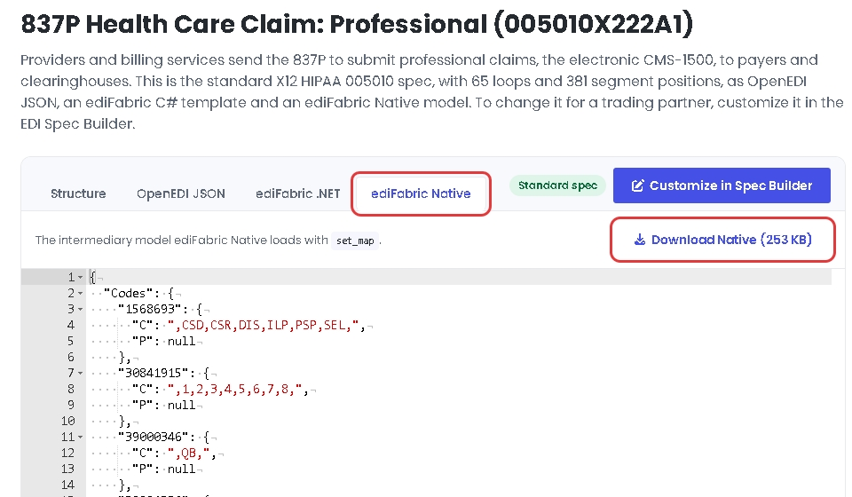
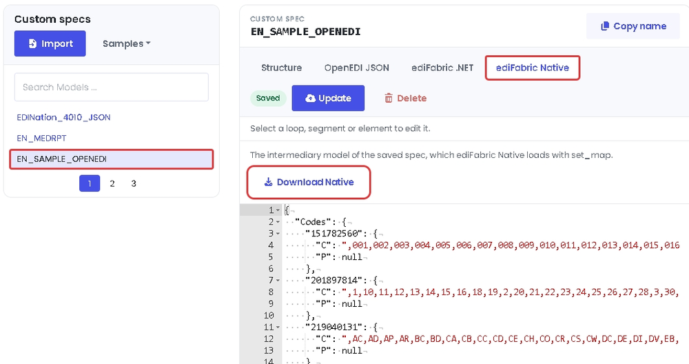
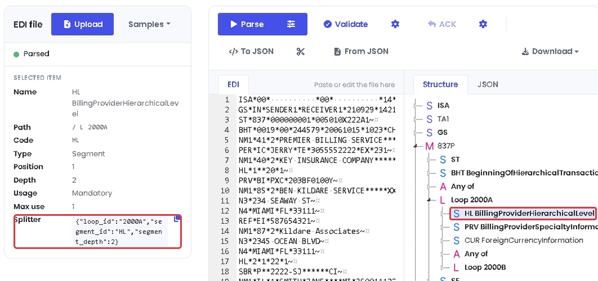

# ediFabric Native X12 - C bindings

**ediFabric Native** is a self-contained, high-performance X12 EDI native shared library. It converts X12 EDI to JSON (and back),
validates transaction sets, and generates acknowledgments — callable from **any
language with a C foreign-function interface** (C, C++, Rust, Go, Python, Node.js,
Java/JNA, .NET, …). No .NET runtime, JVM, or other dependency is required on the
target machine.

C wrappers and examples for [ediFabric Native](https://www.edifabric.com/edifabric-native.html).

| File | Purpose |
| --- | --- |
| `c-abi-edifabric_x12_tools.h` | raw C ABI exported by the shared library |
| `edifabric_x12.h` / `edifabric_x12.c` | convenience wrappers (dynamic load + grow-and-retry) |
| `example_all_functions.c` | runnable walkthrough of every entry point |
| `CMakeLists.txt` / `Makefile` / `build.bat` | build the example |

## Requirements

- A C99 compiler (MSVC, Clang, or GCC)
- CMake 3.16+ (or Make on Linux/macOS)
- 64-bit Windows, Linux, or macOS
- The native library for your platform:

| Platform | File |
| --- | --- |
| Windows | `edifabric-x12-tools.dll` |
| Linux | `edifabric-x12-tools.so` |
| macOS | `edifabric-x12-tools.dylib` |

1. [Sign up free for **Community**](https://www.edifabric.com/pricing.html) to get an evaluation serial key. Community never expires, requires no credit card, and is limited to 250 operations per day for non-production use. After signup, retrieve your serial from [Your Account](https://www.edifabric.com/docs/getting-started/your-account.html).
2. [Download the **ediFabric Native** library](https://www.edifabric.com/docs/edifabric-native/download.html).

Plus your **model files** (per transaction set) and a **map file** that tells the
engine where to find them. See [Model map](#model-map) for details.

## Getting started

**Sign up free for Community** at [edifabric.com/pricing](https://www.edifabric.com/pricing.html)
to get an evaluation serial key, then **download the library** from
[here](https://www.edifabric.com/docs/edifabric-native/download.html).
Put the native library in the repository root, then build and run the walkthrough
with your serial:

### CMake (Windows / Linux / macOS)

```bash
cmake -S . -B build
cmake --build build
./build/example_all_functions --serial YOUR_SERIAL          # Windows: build\Debug\example_all_functions.exe --serial YOUR_SERIAL
```

### Make (Linux / macOS)

```bash
make
./example_all_functions --serial YOUR_SERIAL
```

### MSVC (Windows)

From an x64 Native Tools prompt, or by double-running the helper script:

```bat
build.bat
example_all_functions.exe --serial YOUR_SERIAL
```

It authorizes with your Community (or paid) serial, loads the model map, and
calls every function in the ABI, printing what each one returns.

```
Parse: parse (mode 2, JSON + validation report)
  1754 bytes total, validation starts at offset 1708
  validation -> {"errors":[],"errors_count":0,"data_count":10}
```

Options:

```bash
./example_all_functions --serial YOUR_SERIAL   # Community or paid serial (required)
./example_all_functions --lib /opt/edifabric    # library file or folder
```

You can also set `EDIFABRIC_SERIAL` instead of passing `--serial`.

The library path is resolved from `--lib`, then `EDIFABRIC_X12_LIB`, then the
executable directory, then the working directory. The serial comes from
`--serial`, then `EDIFABRIC_SERIAL`.

All strings and payloads cross the boundary as **UTF‑8 byte buffers**
(`pointer + length`). Every function returns `0` on success or a non-zero
[error code](#error-codes).

## Usage

Copy `edifabric_x12.h`, `edifabric_x12.c`, and `c-abi-edifabric_x12_tools.h` into
your project and link the example the same way (no import library required — the
wrappers load the shared library at runtime).

```c
#include "edifabric_x12.h"
#include <stdio.h>

int main(void)
{
    const char *serial = "your-serial";   /* from your Community or paid plan */
    ef_parse_result result;

    if (ef_load_library(NULL) != 0) {
        fprintf(stderr, "%s\n", ef_last_load_error());
        return 1;
    }

    ef_set_serial(serial);   /* Community: ef_set_serial. Developer: prefer ef_ensure_token. Enterprise: prefer ef_set_token. */
    ef_set_map("{\"default\":\"your-serial\",\"maps\":{}}");

    if (ef_parse(edi_text, EF_PARSE_JSON, NULL, &result) != 0)
        return 1;

    fwrite(result.output.data, 1, (size_t)result.output.length, stdout);
    ef_free(result.output.data);
    return 0;
}
```

Read a file from a subfolder of the binary:

```c
/* see read_file() in example_all_functions.c */
char *edi = read_file("edi/837p.txt", NULL);
```

### Validation and acknowledgments

`ef_parse` fills an `ef_parse_result`. In modes 2 and 3, `offset` marks where the
validation and acknowledgment JSON starts inside `output`.

```c
ef_parse_result result;
const char *config =
    "{\"validate\":{\"snip_level\":2,\"max_errors\":0},"
    "\"ack\":{\"gen997\":false,\"supress_ta1\":false}}";

ef_parse(edi, EF_PARSE_JSON_VALIDATE_ACK, config, &result);
/* transactions = output[0 .. offset), report = output[offset .. length) */
ef_free(result.output.data);
```

| Mode | Constant | Output |
| --- | --- | --- |
| 1 | `EF_PARSE_JSON` | transaction-set JSON |
| 2 | `EF_PARSE_JSON_VALIDATE` | JSON plus a validation report |
| 3 | `EF_PARSE_JSON_VALIDATE_ACK` | JSON plus validation and a 999/997/TA1 acknowledgment |

### Streaming large interchanges

Drive `ef_start_split` / `ef_split` / `ef_get_result` to stream one transaction
set (or repeating loop) at a time. `segment_id` must be `ST` or the first
segment of a repeating loop.

```c
const char *config =
    "{\"split\":{\"segment_id\":\"LX\",\"segment_depth\":6,\"loop_id\":\"2400\"}}";

ef_start_split(edi, EF_PARSE_JSON, config);
for (;;) {
    ef_split_step step;
    ef_buffer payload;
    ef_split(&step);
    if (step.size > 0) {
        ef_get_result(step.size, &payload);
        /* handle payload */
        ef_free(payload.data);
    }
    if (step.is_last)
        break;
}
```

`ef_start_merge` / `ef_merge` / `ef_get_result` streams a full interchange JSON
document back out one segment at a time:

```c
ef_start_merge(transactions_json);
for (;;) {
    int size = 0;
    ef_buffer segment;
    ef_merge(&size);
    if (size == 0)
        break;
    ef_get_result(size, &segment);
    fwrite(segment.data, 1, (size_t)segment.length, out);
    fputs("\r\n", out);
    ef_free(segment.data);
}
```

### Building EDI

```c
ef_buffer edi;
ef_build(transactions_json, "\r\n", &edi);   /* postfix NULL for compact output */
ef_free(edi.data);
```

## API reference

Conventions used by every raw ABI function (and mirrored by the wrappers):

- Returns `int`: `0` = success, non-zero = [error code](#error-codes).
- Inputs are UTF‑8 `byte*` + `int length`.
- Output functions use **grow-and-retry**: if the buffer is too small the call
  returns `1` (`InsufficientCapacity`) and writes the required size into the
  length out-parameter; reallocate and call again.
- Exceptions never cross the boundary.

The wrappers in `edifabric_x12.h` retry `InsufficientCapacity` automatically and
return heap buffers you free with `ef_free()`.

| Group | Functions |
| --- | --- |
| Loading | `ef_load_library`, `ef_library_path`, `ef_last_load_error` |
| Lifecycle | `ef_init_logger`, `ef_shutdown_logger`, `ef_clear_cache` |
| Licensing | `ef_ensure_token`, `ef_get_app_version`, `ef_get_token`, `ef_validate_token`, `ef_set_token`, `ef_get_token_expiration`, `ef_set_serial` |
| Model map | `ef_set_map`, `ef_set_map_bytes` |
| Processing | `ef_parse`, `ef_start_split`, `ef_split`, `ef_build`, `ef_start_merge`, `ef_merge`, `ef_get_result` |
| Errors | `ef_get_error`, `ef_free_error`, `ef_raw_get_error`, `ef_free` |
| Constants | `ef_parse_mode`, `ef_log_level`, `ef_error_code` |

`ef_get_error` copies the message and frees the native string for you. Call
`ef_free_error` only if you invoke `ef_raw_get_error` yourself. Builds that do
not export `free_error` fall back to the C runtime `free`.

To call the shared library directly without the wrappers, include
`c-abi-edifabric_x12_tools.h` and link or `dlopen`/`LoadLibrary` the platform
binary yourself.

## Licensing

> [!NOTE]
> Sign up free for the [Community plan](https://www.edifabric.com/pricing.html)
> to get an evaluation serial key. Community never expires, requires no credit
> card, and is for non-production evaluation, learning, and prototyping
> (250 operations per day). After signup, copy your serial from
> [Your Account](https://www.edifabric.com/docs/getting-started/your-account.html).
>
> If you hit the Community daily quota, native calls return [error 639](#error-codes);
> upgrade at [edifabric.com/pricing](https://www.edifabric.com/pricing.html) if you
> want to continue.

| Plan | What works | Recommended |
| --- | --- | --- |
| Community | `ef_set_serial` only | `ef_set_serial` |
| Developer | `ef_set_serial` and `ef_ensure_token` (`ef_ensure_token` caches the result for 1 day) | `ef_ensure_token` |
| Enterprise | `ef_set_serial`, `ef_ensure_token`, `ef_get_token` / `ef_set_token` | `ef_set_token` (offline tokens) |

```c
/* Community: authorize per process against the license server */
ef_set_serial(serial);

/* Developer (recommended): 1-day built-in cache; refreshes if the token expires within N seconds */
ef_ensure_token(serial, 3600);
int64_t ticks = 0;
ef_get_token_expiration(&ticks);   /* .NET UTC ticks, 0 when unset */

/* Developer (also works): same as Community, online check per process */
ef_set_serial(serial);

/* Enterprise (recommended): fetch / validate / set an offline token yourself */
ef_buffer token;
ef_get_token(serial, &token);
ef_validate_token((const char *)token.data);
ef_set_token((const char *)token.data);
ef_free(token.data);
```

## Model map

`ef_set_map` tells the engine where to find transaction-set models. Keys are
`message:version`. Set `default` to your serial to resolve unmapped transaction
sets through the online spec service, or leave it `null` (or `""`) and map
everything locally.

The example builds that JSON at runtime instead of hard-coding paths. Online
fallback is a JSON object with `default` set to your serial:

```c
char map_json[256];
snprintf(map_json, sizeof map_json,
         "{\"default\":\"%s\",\"maps\":{}}", serial);
ef_set_map(map_json);
```

For local models, load a map file and rewrite each entry's `location` to the
folder that actually holds the JSON files (see `demo_set_local_map` in
`example_all_functions.c`):

```c
char *map_json = build_local_map_json();  /* locations rewritten to absolute map/ */
ef_set_map(map_json);
free(map_json);
```

`map.json` lists each transaction set; `location` is filled in at runtime so the
same file works from any working directory:

```json
{
  "default": "",
  "maps": {
    "837:005010X222A1": { "type": 1, "name": "model837P.json", "location": "" },
    "834:005010X220A1": { "type": 1, "name": "model834.json",  "location": "" }
  }
}
```

You can also mix both: keep `default` as your serial and add local entries under
`maps` for the transaction sets you ship on disk.

All X12 transactions, such as 837P, 834 and 850, are represented as ediFabric Native JSON models. The models are the same on every plan, Community or paid.

**Standard models** come from the [EDI spec library](https://www.edifabric.com/specs/index.html), and you can download them without an account. Open the transaction, for example [837P](https://www.edifabric.com/specs/x12/hipaa/005010/837p.html), and on the **ediFabric Native** tab select **Download Native**.



**Custom models** come from the [EDI Spec Builder](https://www.edifabric.com/spec-builder/index.html). When a trading partner changes the standard, open the transaction in the EDI spec library and select **Customize in Spec Builder**, or import your own OpenEDI file. Edit the OpenEDI schema until it matches the partner's guide and select **Update**. Then, on the **ediFabric Native** tab, select **Download Native**.



Save the downloaded file where the map can name it, and add it to `maps` under its `message:version` key, for example `837:005010X222A1`. The file is the compiled layout the engine loads, not the OpenEDI schema. To change a model, edit the spec in the EDI Spec Builder and download it again. See [EDI models](https://www.edifabric.com/docs/edifabric-native/edi-models.html) and [OpenEDI format](https://www.edifabric.com/docs/getting-started/openedi-format.html).

## Configuration JSON

All JSON uses **`snake_case`** keys and is case-insensitive.

### ParseConfig (`parse`)

```json
{
  "validate": { "regex": null, "date_format": null, "time_format": null,
                "skip_seq_count": false, "skip_hl_seq": false,
                "snip_level": 0, "max_errors": 0 },
  "ack":      { "supress_ta1": false, "ak901p": false,
                "gen_for_valid": false, "gen997": false }
}
```

- `validate` — applied when `mode ≥ 2`; `snip_level` is `1`–`4`.
- `ack` — applied when `mode == 3`.

All sections are optional for `parse`.

### SplitConfig (`start_split`)

```json
{
  "split":    { "segment_id": "ST", "segment_depth": 0, "loop_id": null }
}
```

- `split` — required for `start_split`.

Splitting is possible for the following boundaries:

- Transaction - for files that contain batches of transactions.
- Repeating loop - for files that contain batches of loops, such as order lines, claims or benefit enrollments.

The splitter must be configured as follows:

- `segment_id`  — the name of the segment to split by. It must be either ST or the first segment in the repeatable loop (Mandatory).
- `segment_depth` — the depth of the segment in the model hierarchy (Mandatory).
- `loop_id` — the name of the loop for the segment specified in segment_id (Optional).

The values for the splitter are in [EdiNation](https://edination.edifabric.com/), the free X12 editor. Load a file, select **Parse**, and select the first segment of the loop in the **Structure** tab. For example, to split an 837P by loop 2000A, load the 837P sample from **Samples** and select the **HL** segment in loop 2000A. Under **Selected item**, `segment_id` is **Code**, `loop_id` is the last item in **Path**, and `segment_depth` is **Depth**.

> [!NOTE]
> If a segment shows no **Splitter**, the file can't be split by that segment.

The easiest way to get the splitter configuration is to select the copy button next to **Splitter**, which copies the three values as JSON. Paste them as the value of `split`.



## Threading

The library holds process-global state (model map, active split reader, active
merge writer, last result, license) behind an internal lock. `parse` and `build`
are independent per call, but each split or merge sequence must run to
completion without another split or merge interleaving from a different thread.

## Error codes

`0` is success and `1` means the output buffer was too small. Library-level codes
are exposed as `ef_error_code`, and `ef_get_error(code)` returns the message.
Validation codes (elements, segments, transaction sets, groups, and interchanges)
appear in the parse report when `mode ≥ 2`.

**Error 639** means the Community (evaluation) daily quota was exceeded.
Upgrade your plan at [edifabric.com/pricing](https://www.edifabric.com/pricing.html)
if you wish to continue.

### Parser and library

| Code | Meaning |
| --- | --- |
| 1 | The suggested output buffer size is too small |
| 501 | Unexpected error. Contact support@edifabric.com and include a sample project/file to reproduce the issue |
| 502 | No connection to EdiNation API |
| 503 | The model map configuration is invalid. Check the paths and the model file names are correct |
| 611 | The input buffer is either null or its size is nill |
| 612 | The logger failed to log |
| 613 | The map configuration file is invalid |
| 614 | The output capacity must be positive |
| 615 | Models map must be set before parsing or splitting |
| 616 | Mode must be any of: 1 - Parse, 2 - Parse and Validate, 3 - Parse and Validate and Acknowledge |
| 617 | Parser failed. Contact support@edifabric.com and include a sample project/file to reproduce the issue |
| 618 | Validation failed. Contact support@edifabric.com and include a sample project/file to reproduce the issue |
| 619 | Validation serializer failed. Contact support@edifabric.com and include a sample project/file to reproduce the issue |
| 620 | The token is invalid. Contact support@edifabric.com for assistance |
| 621 | The configuration file is invalid |
| 622 | The split segment ID must not be blank |
| 623 | Call `ef_start_split` before splitting |
| 624 | The result can't be retrieved. Contact support@edifabric.com and include a sample project/file to reproduce the issue |
| 625 | Result buffer size mismatched |
| 626 | Call `ef_start_merge` before merging |
| 627 | The output buffer is either null or its size is nill |
| 628 | The serial number is missing or incorrect. `ef_get_token` doesn't work with Developer license |
| 629 | License was not installed. Contact support@edifabric.com for assistance |
| 630 | No license to use this version. Contact support@edifabric.com for assistance |
| 631 | The token has expired. Get and set a new token to continue |
| 632 | The token is missing. Set token to continue |
| 633 | Reached the maximum number of licenses. Set token to continue |
| 634 | Environment not recognized for licensing or reached the maximum number of licenses |
| 635 | Serial or token not found. Either set token or serial to continue |
| 636 | The rate to get serials was exceeded for your license. Wait for 60 seconds and try again or upgrade your license |
| 637 | Invalid JSON. Enable logging for additional details |
| 638 | The operation is not supported by your license |
| 639 | Community daily quota exceeded. Your license has reached its daily call limit. Upgrade your plan at edifabric.com to continue |

## Troubleshooting

**`Could not load edifabric-x12-tools.dll`** — the library is not on any searched
path. Pass `--lib /path/to/library`, call `ef_load_library(...)`, or set
`EDIFABRIC_X12_LIB`.

**Error 615 on parse** — call `ef_set_map` before parsing or splitting.
`ef_clear_cache` resets the map, so reload it afterwards.

**Error 628 / 635 on parse** — authorize first: `ef_set_serial` on Community,
`ef_ensure_token` (or `ef_set_serial`) on Developer, or `ef_set_token` on Enterprise.

**Error 633 on ensure_token / get_token** — the plan's machine quota is used up.
Contact support.

**Error 639** — the Community (evaluation) daily quota was exceeded. Wait until
the next day, or [upgrade your plan](https://www.edifabric.com/pricing.html) if
you wish to continue.

**Windows: log file in use** — call `ef_shutdown_logger()` before deleting or
replacing the log path; the example does this in a `goto done` cleanup path.

## Links

- [Documentation](https://www.edifabric.com/docs/edifabric-native/introduction.html)
- [Product page](https://www.edifabric.com/edifabric-native.html)
- [Community plan (free signup)](https://www.edifabric.com/pricing.html)
- [Your Account](https://www.edifabric.com/docs/getting-started/your-account.html)
- Support: support@edifabric.com
